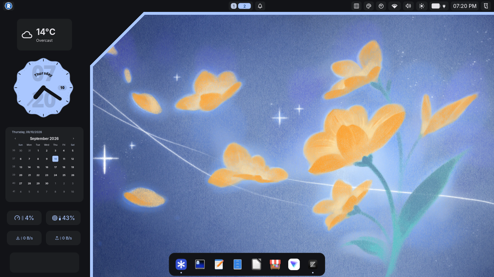

# Angular Frame

A Wayland desktop Frame built with [Quickshell](https://quickshell.outfoxxed.me/) and Qt Quick, featuring an angular panel frame and a scalloped analog clock.

## Overview

The shell renders a background layer on Wayland with two components:

- **Angular Frame** — A full-screen background layer that paints a left sidebar panel with a diagonal cut (chamfered top-right corner), creating the angular aesthetic visible in the screenshot. A thin accent stroke traces the top edge and the diagonal cut.

- **Scalloped Clock** — An analog clock with a scalloped (wavy) edge face, configurable tick marks, hour numbers, clock hands, a curved day-of-week label, and a faint digital time overlay. Fully configurable via `settings.json`. See [Clock.README.md](Clock.README.md) for full details.

## Files

| File            | Purpose                                                                                  |
| --------------- | ---------------------------------------------------------------------------------------- |
| `shell.qml`     | Main entry point. Defines the full-screen background layer with the angular frame shape. |
| `Clock.qml`     | Analog clock component with scalloped face, hands, tick marks, and digital overlay.      |
| `Colors.qml`    | Singleton that reads accent/background/primary colors from `noctalia-colors.json`.       |
| `settings.json` | Clock configuration (size, scallops, amplitude, visibility toggles, hand lengths).       |

## Configuration

Colors are sourced from `~/.config/quickshell/noctalia-colors.json` and updated in real time. Edit that file (or your pywal setup) to change the theme.

Clock settings live in `settings.json` — see the `Clock.qml` `JsonAdapter` block for all available properties (window size, scallop count, amplitude, hand thickness, visibility flags, etc.).

## Dependencies

- [Quickshell](https://quickshell.outfoxxed.me/) with Wayland support
- Qt 6 (QtQuick, QtQuick.Controls, QtQuick.Shapes)
